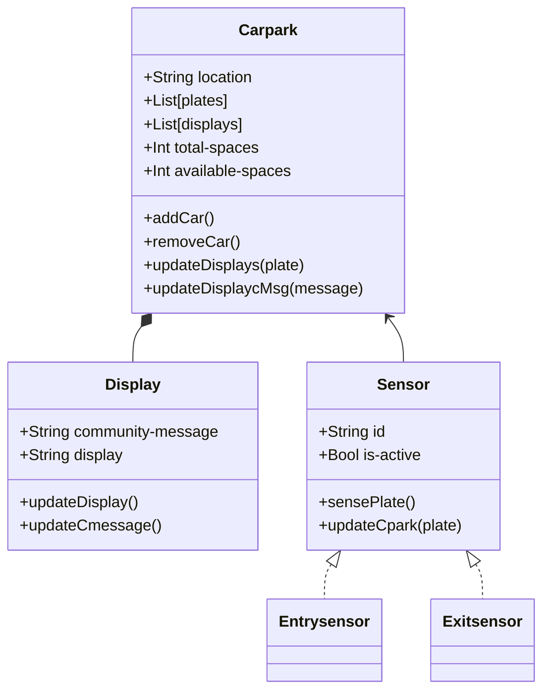

# Planning for classes

```mermaid
classDiagram
    
class Carpark {
    +String location
    +List[plates]
    +List[displays]
    +Int total-spaces
    +Int available-spaces
    +addCar()
    +removeCar()
    +updateDisplays(plate)
    +updateDisplaycMsg(message)
    
}

class Display {
    +String community-message
    +String display
    +updateDisplay()
    +updateCmessage()
}

class Sensor {
    +String id
    +Bool is-active
    +sensePlate()
    +updateCpark(plate)
}
Sensor <|.. Entrysensor
Sensor <|.. Exitsensor
Carpark *-- Display
Carpark <-- Sensor

```