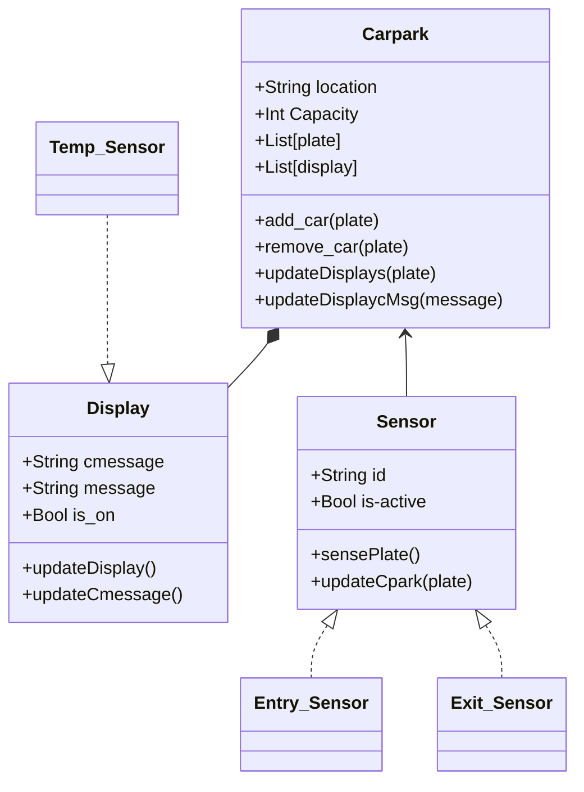

# Planning for classes

```mermaid
classDiagram
    
class Carpark {
    +String location
    +Int Capacity
    +List[plate]
    +List[display]
    +add_car(plate)
    +remove_car(plate)
    +updateDisplays(plate)
    +updateDisplaycMsg(message)
    
}

class Display {
    +String cmessage
    +String message
    +Bool is_on
    +updateDisplay()
    +updateCmessage()
}

class Sensor {
    +String id
    +Bool is-active
    +sensePlate()
    +updateCpark(plate)
}
Sensor <|.. Entry_Sensor
Sensor <|.. Exit_Sensor
Carpark *-- Display
Carpark <-- Sensor
Temp_Sensor ..|> Display

```